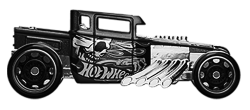

<div align="center">
    
    <h1>
      boneshaker-api
    </h1>
    An API for all bone shaker fandom hotwheels.
</div>

<br>
<div align="center">

[](#about)
[](/LICENSE)
[](#authors)

</div>

## About

JSON structure example:

```json
{
  "id": 1, // auto id
  "toy_code": "", // string
  "toy_image": "", // string src
  "year": 2020, // number
  "model": "", // open_roof or closed_roof
  "series": "", // string
  "external_color": "", // lowercase string
  "inner_color": "", // lowercase string
  "tampo": "", // string
  "details": "", // string
  "wheel_type": "", // string
  "wheel_image": "", // string src
  "madein": "", // string
  "notes": "", // string
  "variations": [
    // array by "toy_code" - first element is default and others are variations
    {
      "toy_image": "", // string src
      "year": 2020, // number
      "model": "", // open_roof or closed_roof
      "series": "", // string
      "external_color": "", // lowercase string
      "inner_color": "", // string
      "tampo": "", // string
      "details": "", // string
      "wheel_type": "", // string
      "wheel_image": "", // string src
      "madein": "", // string
      "notes": "" // string
    }
  ]
}
```

## How to use

1. [under construction]

## Authors

|      [Rafael Prado](http://www.github.com/rpradosilva)      |
| :---------------------------------------------------------: |
|  |

---

[](http://rprado.design)
